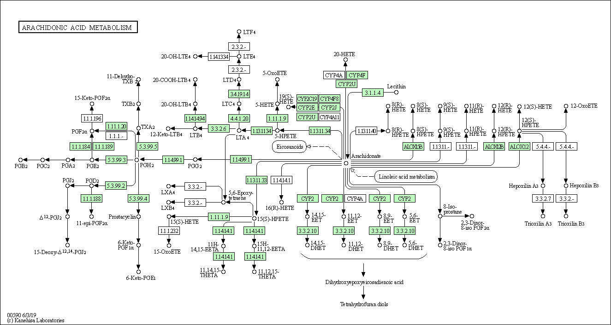
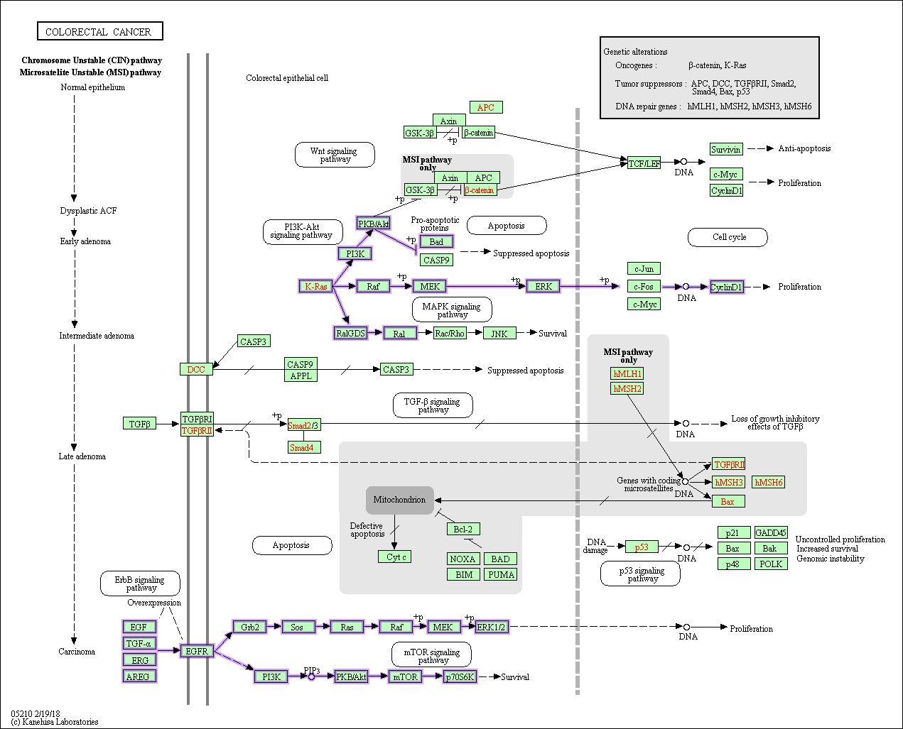
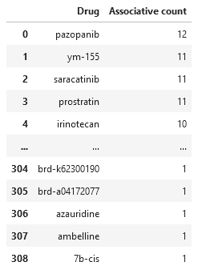

# Disease subsetting and personalized medication recommendation

## Contributors

David Enoma ()

Jędrzej Kubica (jj.kubica@student.uw.edu.pl)

## What kind of problem are we trying to solve?
The consensus molecular subtypes (CMS) classification classifies colorectal cancer into four molecular subtypes with distinct biological characteristics, which may form the basis for clinical stratification and subtype-based targeted intervention. We aim to develop a tool that would, based on this information, automate drug recommendation for patients with a specific molecular subtype of colorectal cancer.

## What does our tool do?
Our tool performs RNA-seq pathway analysis based on CMS data of the colorectal cancer, in search of differentially (over/under) expressed pathways that are associated with different subtypes of colorectal cancer. The final result of that analysis is visualized in an R Shiny dashboard.

The analysis result is then used to come up with drug recommendations based on enzymes involved in that pathways and finding their inhibitors or activators. Overall, this entire workflow creates a link between a colorectal cancer subtype that a specific patient is suffering from, and a drug that could be used in treatment of the disease. That means that the drug recommendation is personalized.

## Overall pipeline


## Pathway analysis
### Pipeline steps
1. Download CMS SRA data from NCBI using SRA toolkit: (https://www.ncbi.nlm.nih.gov/Traces/study/?query_key=3&WebEnv=MCID_622b744a94b9b522d227f612&f=consensus_molecular_subtype_sam_s%3An%3Ac&o=acc_s%3Aa)

    Run selector for:
    - Colorectal cancer
    - Homo Sapiens
    - RNA

    In Selector select:
    - consensus_molecular_subtype
    - cms1, cms2, cms3 and cms4
2. Extract .fastq files from .sra files using fastq-dump:
3. Read mapping using hisat2:
   - hisat2 index for GRCh38 reference genome (NCBI)
   - hisat2 mapper for fastq files
4. Pathway analysis with pathway_visualisation.R
5. _TODO_ Parsing and radar-plotting of pathway_visualisation.R results (.xml files)

### Visualisation of pathway analysis done with demo data



_TODO_ 
- Extract over/underexpression from .xml files (radar_plots.ipynb)

Radar plot example:


## Treatment recommendation

### Key features for clinicians and clinical researchers

* KEGG and Drugmonizome API-based applet to fetch all drugs targeting an input gene/pathway in a given disease pathway diagram (e.g. colorectal cancer)
* Drugs are ranked according to a definition of associative strength (currently associated node count but could be based on another algorithm based on the importance of nodes or representation in literature)
* Pathway visualization linked with the drug suggestions

### Method
1. Using Drugmonizome API, 'L1000FWD Upregulated KEGG Pathways' and 'L1000FWD Downregulated KEGG Pathways' datasets are downloaded to capture expression changes in both directions.

```
df_upregulated = parse_gmt_to_df('L1000FWD Upregulated KEGG Pathways/L1000FWD_KEGG_Pathways_drugsetlibrary_up.gmt')
df_downregulated = parse_gmt_to_df('L1000FWD Downregulated KEGG Pathways/L1000FWD_KEGG_Pathways_drugsetlibrary_down.gmt')
```
2. Filter small molecules/drugs registered with a particular disease (in this case, `'colorectal cancer'`)

```
df_upregulated = df_upregulated.loc[df_upregulated['Colorectal cancer'] == 1]
df_downregulated = df_downregulated.loc[df_downregulated['Colorectal cancer'] == 1]
```

3. `suggest_drugs(search_nodes)` takes a list of target nodes in the colorectal cancer pathway (e.g. shown in figure below) and outputs a list of all colorectal cancer drugs detected in the Drugmonizome database that match the input.



Example output:
```
Target: ["ERK", "EGF", "TGFA", "EREG", "AREG", "EGFR", "KRAS", "NRAS", "PI3K", "RalGDS"]
Your top 5 suggested drugs:
pazopanib
which targets:
['KRAS', 'NRAS', 'PERK-mediated unfolded protein response (GO:0036499)', 'regulation of ERK1 and ERK2 cascade (GO:0070372)', 'VEGFA', 'AREG', 'positive regulation of ERK1 and ERK2 cascade (GO:0070374)', 'EGF', 'VEGFB', 'VEGFR inhibitor', 'EGFR', 'TGFA']
ym-155
which targets:
['ERK1 and ERK2 cascade (GO:0070371)', 'HBEGF', 'negative regulation of ERK1 and ERK2 cascade (GO:0070373)', 'regulation of ERK1 and ERK2 cascade (GO:0070372)', 'AREG', 'VEGFA', 'PI3K-Akt signaling pathway', 'EREG', 'CERK', 'EGFR', 'TGFA']
saracatinib
which targets:
['HBEGF', 'VEGFC', 'KRAS', 'NRAS', 'AREG', 'VEGFA', 'PI3K-Akt signaling pathway', 'EGF', 'EREG', 'EGFR', 'TGFA']
prostratin
which targets:
['HBEGF', 'VEGFC', 'regulation of ERK1 and ERK2 cascade (GO:0070372)', 'AREG', 'VEGFA', 'PI3K-Akt signaling pathway', 'positive regulation of ERK1 and ERK2 cascade (GO:0070374)', 'EREG', 'MEGF9', 'EGFR', 'TGFA']
irinotecan
which targets:
['HBEGF', 'KRAS', 'NRAS', 'regulation of ERK1 and ERK2 cascade (GO:0070372)', 'AREG', 'VEGFA', 'PI3K-Akt signaling pathway', 'EREG', 'EGFR', 'TGFA']
```



### Future steps
* An interface to easily access information about each drug


## Installation & software requirements

To run the pathway analysis pipeline (run_pipeline.sh), the following tools need to be installed:

`SRA-toolkit`, `fastq-dump`, `hisat2_index`, `hisat2_mapper`

To run the 

`BiocManager::install(c("pathview", "gage", "gageData", "GenomicAlignments","TxDb.Hsapiens.UCSC.hg19.knownGene"))`

To run the drug recommendation pipeline, the following packages need to be installed: `urllib`, `json`, `logging`, `pandas`, `numpy`, and `scipy`.
