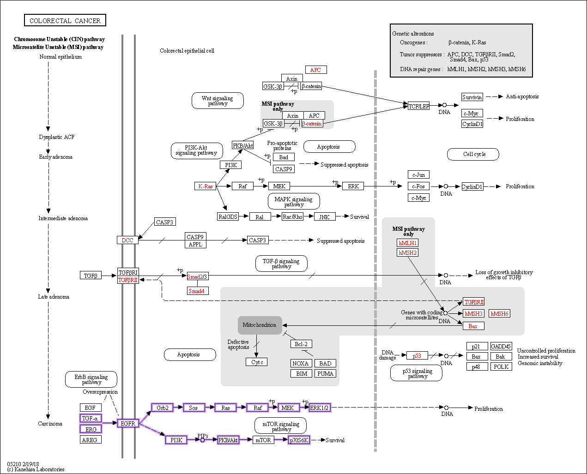

# Disease_subsetting

## Overall pipeline


## Pathway analysis
Pipeline steps:
1. Download CMS SRA data from NCBI using SRA toolkit:

    Run selector for:
    - Colorectal cancer
    - Homo Sapiens
    - RNA

    In Selector select:
    - consensus_molecular_subtype
    - cms1, cms2, cms3 and cms4
2. Extract .fastq files from .sra files using fastq-dump:
3. Read mapping using hisat2:
   - hisat2 index for GRCh38 reference genome (NCBI)
   - hisat2 mapper for fastq files


## Treatment recommendations
* The immediate goal right now is to link the pathway analysis output somehow to KEGG pathway or network database. Input could be: pathway/gene, overexpression/underexpression/mutation extent score, as well as a value to represent how focal/common that pathway/gene is to colorectal cancer.
* KEGG API-based applet to fetch all drugs targeting an input gene/pathway has been built.
* We can then build an equation/mini-algorithm to come up with top *n* drugs given the pathway information
* Alternatively, we can solely base it on literature-searched drugs relevant to the specific pathways

## Visualization
### Output for clinicians and clinical researchers

Things to be included:
* CMS subtype classification
* Tumor site associated with the CMS subtype?
* List of suggested drugs/treatments (potentially ranked)
* Literature sources for those suggested medications/DB links (e.g. KEGG)
* Pathway visualization linked with the drug suggestions

e.g. target pathway:



## Installation
**1.** Building/deploying docker.... 
```
docker, docker, docker
```
**2.** Setting up the Environment

CHANGE THIS A docker container was built to run the expression variants analysis and visualization pipeline. The recipe file (expressed_variants.def) will be available this Git repository.

To build the singularity container on your unix environment, do:
```
singularity build expressed_variants.sif expressed_variants.def
```

To run the container on your unix environment, do:
```
singularity run expressed_variants.sif
```

To run specific R packages by using the container, do:
```
singularity exec expressed_variants.sif R <path_to_Rscript>
```

**3.** Software Requirements

The following expression variants analysis tools have been installed in this container:

```
R version 4.0.4 (2021-02-15) -- "Lost Library Book"
Bioconductor: 3.12
ggplot2: 3.3.5
gridExtra: 2.3
dplyr: 1.0.7
tidyr: 1.1.4
magrittr: 2.0.2
rWikiPathways: 1.10.0
ggradar: 0.2
ggpubr: 0.4.0

```

## Methods

### Inputs:

### Outputs:

### Detailed flow charts:

## Implementation (codes)

### (step 1) Preparing the sample files:<br/>
**1.**<br/>
```
(codes)
```

### (step 2) :<br/>
**1.**<br/>
```
(codes)
```

### (step 3) :<br/>
**1.**<br/>
```
(codes)
```
